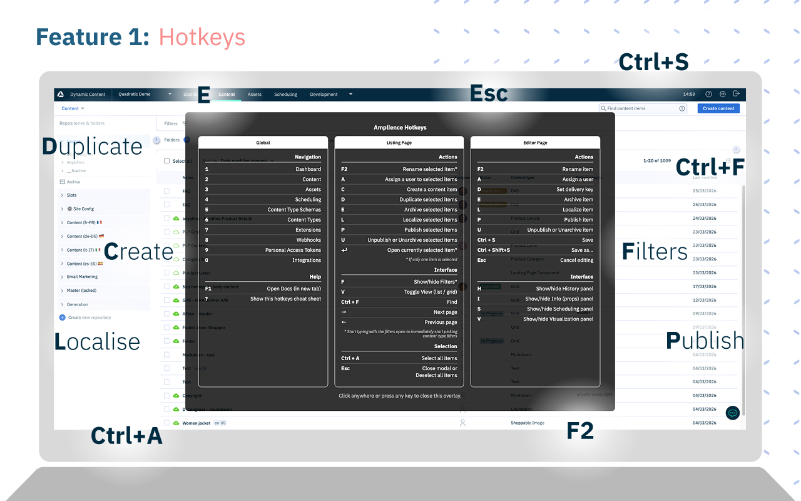
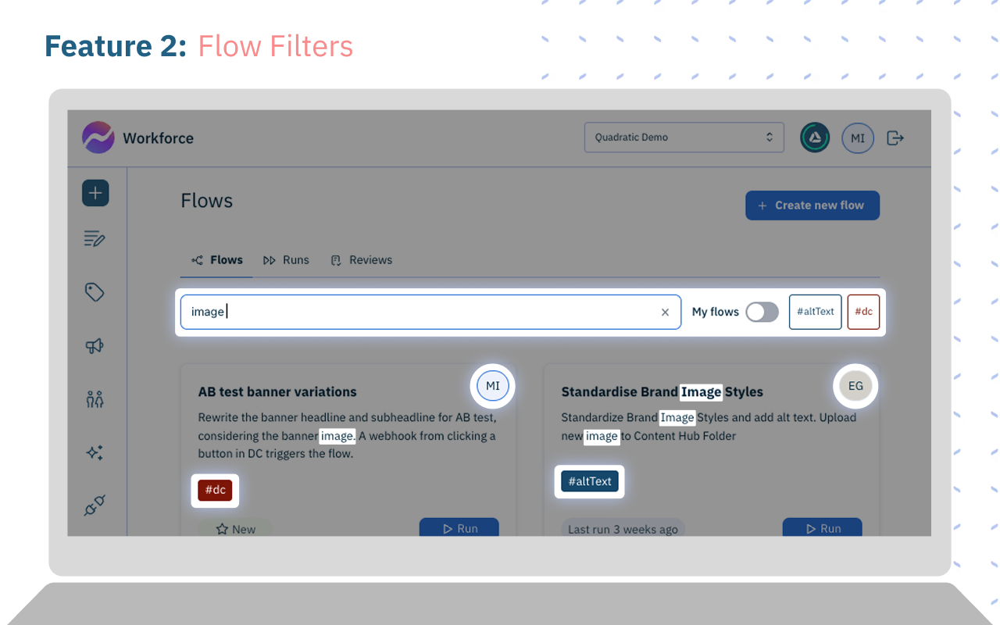
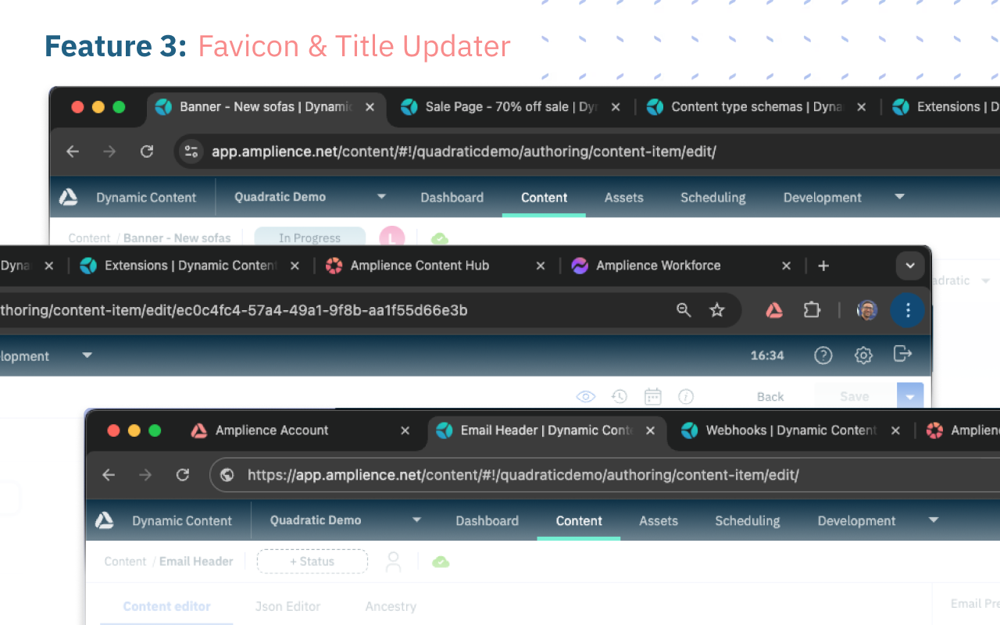

#  Amplience Helper

A suite of tools bundled in a browser extension to help every-day Amplience super-users create content at the speed of ideas.

## Features / Modules

|                                                                                 |                                                                                                                                                                                                                             |
| ------------------------------------------------------------------------------- | --------------------------------------------------------------------------------------------------------------------------------------------------------------------------------------------------------------------------- |
|                                    | [**Hotkeys** (Read more)](modules/hotkeys/README.md)<br />Keyboard shortcut layer for faster navigation and actions. (Press `?` to see a list)                                                                              |
|                          | [**Flows Filter** (Read more)](modules/flows-filter/README.md)<br/>Adds filters to better manage your Workforce Content Flows. (You can now archive flows and search & filter by search-term, tag or author)                |
|  | [**Favicon & Title Updater** (Read more)](modules/favicon-swapper/README.md)<br />Swaps the browser tab favicon to reflect which Amplience interface you're in, and prepends a context-aware title to help tell tabs apart. |
|                                    | [**Theming** (Read more)](modules/theming/README.md)<br />Per-hub colour and dark-mode controls for the Amplience DC interface, configurable from popup and options, to help tell your hubs apart.                          |
|                        | [**Style Patches** (Read more)](modules/style-patches/README.md)<br />Responsive and readability CSS improvements for the Amplience DC interface.                                                                           |

Each of these can be toggled on/off from the toolbar or in the options page.

## Installation

### Chrome Web Store (recommended)

Install directly from the [Chrome Web Store](https://chromewebstore.google.com/detail/amplience-helper) — Chrome handles all future updates automatically.

### Manual install (for developers)

1. Download or clone this repository

2. Open Chrome and go to `chrome://extensions/`

3. Enable **Developer mode** (top right)

4. Click **Load unpacked**

5. Select the `amplience-helper` folder you downloaded in step 1

The extension will now be active on `https://app.amplience.net/content/*` and `https://app.amplience.net/content-studio/*`

\
_Here are steps 2-5 in action. (Also installing our two other browser extensions - [Amplience Hotkeys](https://github.com/mattisherwood/amplience-hotkeys) and [Favicon Swapper](https://github.com/mattisherwood/favicon-swapper))_

_**TIP:** While you're in the extension manager; if you click **Details** on the extension you can select **'Allow in Incognito'** if you wish it to also be applied to incognito windows._

### Updating to newer versions

- **Chrome Web Store install:** Chrome updates the extension automatically — no action needed.
- **Manual (Load unpacked) install:** Download the latest release and re-run the steps above. It will replace the old version. Refresh any open Amplience tabs after reloading.

## How It Is Organized

```
amplience-helper/
├── icons/        # Extension icons
├── modules/      # Self-contained modules
│   ├── module-name/
│   |   ├── module-name.css
│   |   ├── module-name.js
│   |   ├── CHANGELOG.md
│   |   └── README.md
│   └── ...
├── manifest.json # Extension configuration
├── options.html  # Options page UI
├── options.js    # Options page behavior & setting persistence
├── popup.html    # Toolbar popup UI
├── popup.js      # Toolbar popup behavior & setting persistence
├── CHANGELOG.md  # Top-level user-focused changelogs
└── README.md     # Top-level documentation
```

## Troubleshooting

1. Reload the extension in `chrome://extensions/` after pulling updates.
2. Hard refresh Amplience pages after reloading extension code.
3. Confirm module toggles are enabled in popup/options.
4. Check DevTools > Sources > Content scripts to verify module scripts are injected.

## Development

### Adding new modules

1. Add your new module folder and files

   ```
   /modules/
   └─module-name/
      ├── module-name.css # styles
      ├── module-name.js  # scripts
      ├── CHANGELOG.md    # changelog
      └── README.md       # docs
   ```

2. Update `manifest.json` to include the new module files
3. Update the `options.html/js` and `popup.html/js` files to include the new module in the toggle lists
4. It's up to you to get your module to trigger and clean-up when that toggle value changes.

## What's up next?

Future additions include

- Bundling in the favicon+title updater currently in [Favicon Swapper](https://github.com/mattisherwood/favicon-swapper)

## License

This is a utility extension for personal/internal use. Amplience is a trademark of Amplience Ltd.

## Contributing

To contribute improvements:

1. Fork/clone this repository
2. Make your changes
3. Test thoroughly on https://app.amplience.net/content
4. Submit a pull request with a clear description

## Changelogs

- View the user-focused changelog in [/CHANGELOG.md](/CHANGELOG.md)
- Drill down into the more specific maintainer-focused module changelogs
- Please follow the templates & rules-of-engagement in [/CHANGELOG-templates.md](/CHANGELOG-templates.md)

## Support

For issues or questions:

1. Review this README or those of the modules
2. Open an issue on GitHub
3. Get in touch

---

**Made with ❤️ for Amplience users**
